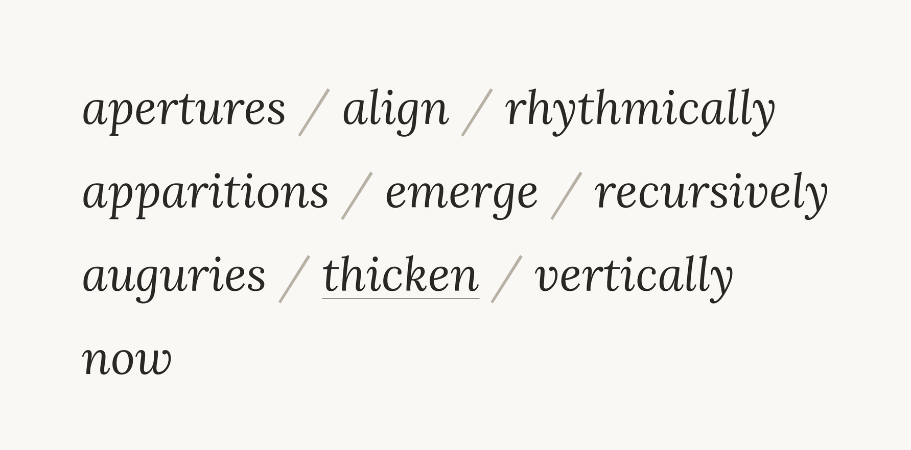

# Triptych

A Prolog (or *pro-logos*) realisation of a system poem.

The generator produces 72 variants of the poem:

> 3 nouns × 3 verbs × 4 adverbs × 2 syntactic orders = 72

One variant for each solar eclipse in Saros 126 (1179–2459).



## About

*Sun* treats language as a combinatory machine in the Hjelmslevian sense of glossematics: meaning emerges not from words in isolation but from finite elements permuted through fixed constraints. 

A ten-word grid, three nouns, three verbs, four adverbs, the last being the deictic *now*, generates seventy-two variants, structurally mapped onto the seventy-two eclipses of Saros 126.

For Louis Hjelmslev, a language is pure *form*: a network of relations laid over an unformed *substance*, and articulated across two planes: *expression* (the signifier side) and *content* (the signified side). 

Beneath its signs sit *figurae*, a small closed inventory of elements that recombine under rule to yield an unbounded output. *Sun* takes this literally. Ten words are the inventory, the grid is the rule, and the seventy-two poems are what the system contains.

## Why Prolog

Prolog mirrors the structuralist logic of the combinatory machine. Unlike procedural languages, it is *declarative*: it states the constraints of a system rather than the steps to execute it. Its primitive is the relation — the *predicate* — exactly as Hjelmslev's primitive is the *function*, the dependence between elements. 

In both, the relation comes first; the terms are defined by the positions they occupy within it.åexhaustively enumerating every admissible combination of the grid. The poems are therefore not *written* one by one — they are *proved*, each a logical consequence of the paradigmatic axes. 

The language's own roots are in computational linguistics: Prolog was built in Alain Colmerauer's Marseille group around 1972, out of work on parsing natural language, which is the source of its precise control over syntactic order and deictic anchoring.

## Usage

Requires SWI-Prolog.

```bash
swipl saros.pl
```

Output:

```
1. apertures align rhythmically
2. apertures align vertically
3. apertures align recursively
4. apertures align now
...
72. now, apparitions emerge
```

## Why 72

- 72 eclipses in Saros 126 (1179–2459)
- 72 variants of the poem
- 72 lines of code
- 72 outputs when run

## Inspiration

**The Antikythera mechanism** — the bronze, hand-cranked calculator (c. 2nd century BCE) whose spiral dial carried one glyph for each eclipse it could predict across the Saros cycle. *Sun* keeps the gesture and drops the bronze: one variant per eclipse of Saros 126. Where the mechanism was bound to a longitude, the grid is placeless, anchored only by the deictic *now*.

**Howard Russell Butler's eclipse triptych** (1918 Baker, Oregon; 1923 Lompoc, California; 1925 Middletown, Connecticut) — three oil paintings of total solar eclipses, recorded in rapid shorthand during the few minutes of totality and reconstructed for the Hayden Planetarium. 

Butler's three-panel form, and his treatment of the corona as at once a scientific record and an aesthetic object, is the precedent for the triptych: three videos, three nouns, one transient event encoded for later realization.

## Further reading

For the full essay on heteroglossia, chronotopes, and glossematics, see [bergholt.net/glossary](https://bergholt.net/glossary).

## License

MIT License. Feel free to use for your own projects.

---

Copenhagen, 2026
